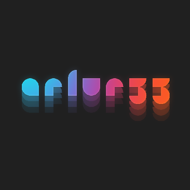

# Artur's Portfolio ✨




## 📝 Project Description

This project is a personal portfolio website created for my friend, Artur. He didn't have a portfolio website, so I decided to create one for him.

## 🌟 Features

- **Responsive Design**: The website is fully responsive and adapts to various screen sizes.
- **Interactive Elements**: Buttons, modals, and animated backgrounds.
- **Python Integration**: Execute Python code snippets directly on the webpage.
- **Social Links**: Links to Artur's social media profiles.

## 🚀 Demo

You can view the live website [here](https://exelvi.github.io/artur3333.github.io/).

## 📥 Installation

To run this project locally, follow these steps:

1. Clone the repository:

    ```bash
    git clone https://github.com/EXELVI/artur3333.github.io.git
    ```

2. Navigate to the project directory:

    ```bash
    cd artur3333.github.io
    ```

3. Open the `index.html` file in your browser to view the website.


## 🤝 Contributing

Contributions, issues, and feature requests are welcome! Feel free to check the [issues page](https://github.com/EXELVI/artur3333.github.io/issues).
